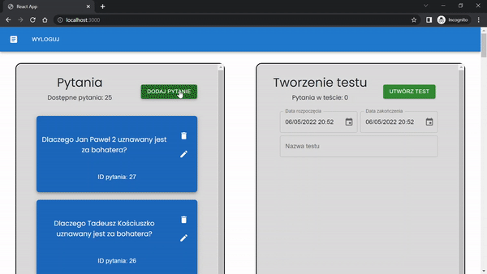
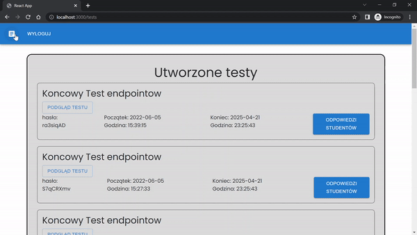

# Frontend Teacher App
This app was created as a student project for PZSP2 class at WUT.
## General info
This application is for the teachers to be able to add questions to a database and create tests.
After completing those steps, the teacher can pass the generated access token to the students, and later view and mark the answers.
The app allows for exporting the marks to a CSV file.




## Technologies
- Node 14.0.0+ (latest LTS recommended)
- React 18.0.0+

This project was bootstrapped with [Create React App](https://github.com/facebook/create-react-app).

## Prerequisites
Prior to running the app, you need to install node.js on your local machine.

With node install [serve]():
### `npm install -g serve`

## Usage

Launch the [backend app](https://github.com/JakubTomaszewski/PZSP2-Backend) first.

Then in the project directory, to build the application you can run:

### ``` npm run build ```

and to launch it:

### ``` serve -s build ```

Open [http://localhost:3000](http://localhost:3000) to view it in your browser.

## License
[MIT](https://choosealicense.com/licenses/mit/)